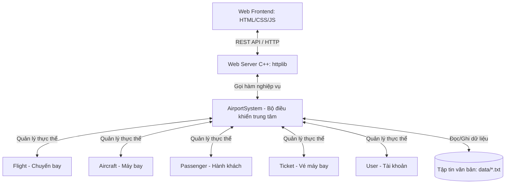
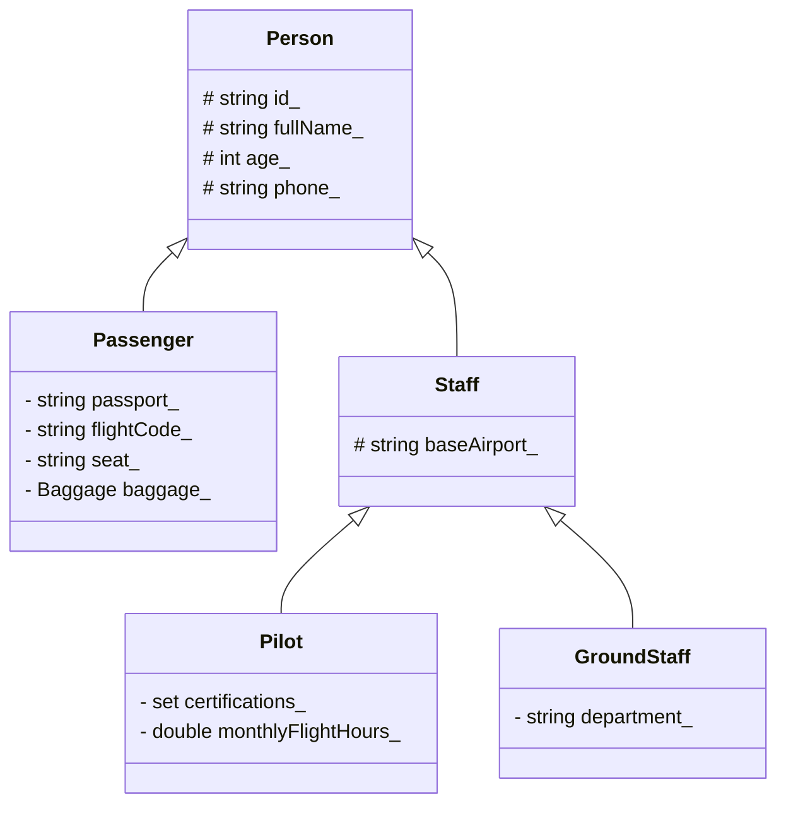

# SkyGate — Hệ thống Quản lý Sân bay & Đặt vé máy bay

Hệ thống quản lý sân bay (SkyGate) được xây dựng trên nền tảng **C++ hướng đối tượng (OOP)** vững chắc ở Backend, kết hợp giao diện **Web (HTML/CSS/JS)** hiện đại ở Frontend thông qua **REST API**. Đây là Bài tập lớn môn **Lập trình hướng đối tượng (LTHDT)** của Nhóm 5 — Trường Đại học Sư phạm Kỹ thuật TP.HCM (HCMUTE).

🔗 **Link trải nghiệm trực tuyến:** [http://159.65.141.209:8888](http://159.65.141.209:8888)

> **Tài khoản demo:**
> * **Quản trị viên (Admin):** `admin` / `admin123`
> * **Nhân viên (Staff):** `staff` / `staff123`
> * **Khách hàng (Customer):** `customer` / `cus123`

---

## 1. Tổng quan hệ thống & Nghiệp vụ

SkyGate mô phỏng hoạt động điều hành tại một **sân bay nhà (sân bay PHG)**, quản lý vòng đời chuyến bay, điều phối máy bay/tổ bay/cổng đỗ, và giám sát hành khách từ khi mua vé đến khi lên máy bay.



### Phân quyền người dùng (Role-based Authentication)

Hệ thống được thiết kế phân quyền chặt chẽ ngay từ Backend (không chỉ ẩn/hiện nút ở Frontend):

| Vai trò | Phạm vi nghiệp vụ | Quyền hạn chính |
| :--- | :--- | :--- |
| **Admin** | Quản lý hệ thống & Hạ tầng | Khởi tạo/xoá máy bay và đường băng; Tạo/xoá chuyến bay; Quản lý tài khoản (Thêm/xoá Staff/Customer); Hoãn/huỷ chuyến bay. |
| **Staff** | Điều hành & Giám sát | Đổi trạng thái chuyến bay; Check-in & Boarding (Lên máy bay) cho khách; Đặt/huỷ vé hộ; Theo dõi cảnh báo hành lý/quá tải. |
| **Customer** | Mua vé & Tra cứu | Tìm kiếm chuyến bay khả dụng; Đặt vé trực quan chọn ghế; Huỷ vé của chính mình; Theo dõi trạng thái hành trình cá nhân. |

---

## 2. Quy tắc Nghiệp vụ hàng không (Domain Rules)

Hệ thống mô phỏng thực tế với các ràng buộc nghiệp vụ hàng không chặt chẽ:

*   **Tương thích hạ tầng:** Máy bay chỉ được gán vào chuyến bay nếu sân bay đi có đường băng đủ dài (`runwayLength >= requiredRunwayLength()`) và loại cổng đỗ phù hợp (`gateRank >= minGateRank()`).
*   **Vòng đời chuyến bay (Flight Lifecycle):** Trạng thái chuyến bay chuyển dịch tự động hoặc thủ công theo luồng:
    $$\text{Scheduled} \rightarrow \text{Check-in} \rightarrow \text{Boarding} \rightarrow \text{Gate Closed} \rightarrow \text{Ready} \rightarrow \text{Takeoff} \rightarrow \text{In Air} \rightarrow \text{Landed} \rightarrow \text{Turnaround} \rightarrow \text{Completed}$$
*   **Thời gian quay đầu (Turnaround time):** Khoảng cách giữa 2 chuyến bay liên tiếp sử dụng cùng một máy bay phải lớn hơn thời gian bảo dưỡng tối thiểu (`minTurnaroundMinutes`) của loại máy bay đó.
*   **Giới hạn phi công (Crew constraints):**
    *   Phi công bắt buộc phải có chứng chỉ phù hợp với phân loại máy bay (`WideBody`, `NarrowBody`, `Turboprop`).
    *   Tổng giờ bay trong tháng của phi công không được vượt quá **100 giờ**.
    *   Giờ nghỉ giữa hai chuyến bay liên tiếp của phi công phải đạt tối thiểu **8 tiếng**.
*   **Quy trình hành khách:** Khách chỉ được **Check-in** khi chuyến bay ở trạng thái `Check-in` hoặc `Boarding`. Khách chỉ được **Lên máy bay (Boarding)** khi chuyến bay ở trạng thái `Boarding`. Khi cửa khởi hành đóng (`Gate Closed` trở đi), hành khách chưa lên máy bay sẽ bị đánh dấu là **Trễ chuyến (No-show)**.

---

## 3. Kiến trúc hướng đối tượng (OOP) của SkyGate

Dự án là một minh chứng thực tế về việc áp dụng 4 tính chất cốt lõi của OOP:

### 3.1. Tính Đóng gói (Encapsulation)
Toàn bộ dữ liệu của các thực thể được bảo vệ bằng phạm vi truy cập `private` hoặc `protected`. Việc đọc và ghi dữ liệu phải đi qua các hàm Getter/Setter công khai (`public`) có tích hợp kiểm tra ràng buộc.

*Minh họa đóng gói trong [Person.h](file:///d:/LTHDT/skygate/src/people/Person.h):*
```cpp
class Person {
protected:
    std::string id_;
    std::string fullName_;
    int age_ = 0;
    std::string phone_;

public:
    const std::string& id() const { return id_; }
    void setAge(int age) {
        if (age >= 0) age_ = age; // Kiểm tra tính hợp lệ dữ liệu
    }
};
```

### 3.2. Tính Kế thừa (Inheritance)
Hệ thống kế thừa phân cấp giúp tái sử dụng mã nguồn và quản lý các nhóm thực thể tương đồng một cách khoa học.



*Minh họa kế thừa trong [Pilot.h](file:///d:/LTHDT/skygate/src/people/Pilot.h):*
```cpp
class Pilot : public Staff {
private:
    std::set<AircraftCategory> certifications_;
    double monthlyFlightHours_ = 0.0;
    DateTime lastFlightEnd_;
    // ...
};
```

### 3.3. Tính Đa hình (Polymorphism)
Sử dụng hàm ảo (`virtual`) và phương thức ghi đè (`override`) cho phép hệ thống gọi các hành vi chuyên biệt của các lớp con thông qua con trỏ hoặc tham chiếu của lớp cha.

*Ví dụ, khi kiểm tra hạ tầng sân bay cho một máy bay bất kỳ:*
```cpp
// Lớp cha Aircraft định nghĩa hàm ảo thuần túy
virtual int requiredRunwayLength() const = 0;
virtual int minGateRank() const = 0;
```
*Các lớp con kế thừa tự triển khai:*
```cpp
// WideBodyAircraft (Máy bay thân rộng) yêu cầu đường băng dài và gate hạng cao
int requiredRunwayLength() const override { return 2800; }
int minGateRank() const override { return 2; } // Cần DoubleJetBridge

// TurbopropAircraft (Máy bay cánh quạt) yêu cầu đường băng ngắn và gate bãi ngoài
int requiredRunwayLength() const override { return 1200; }
int minGateRank() const override { return 0; } // Chỉ cần RemoteStand
```

### 3.4. Tính Trừu tượng (Abstraction)
Các lớp cơ sở như `Person`, `Aircraft` và `User` được thiết kế dưới dạng lớp trừu tượng (chứa hàm ảo thuần túy và hàm hủy ảo), định nghĩa ra các giao diện (interface) nghiệp vụ mà không cần biết chi tiết triển khai cụ thể của từng loại đối tượng.

---

## 4. Cấu trúc thư mục dự án

```text
├── src/                  # Mã nguồn Backend C++ (OOP)
│   ├── aircraft/         # Định nghĩa các loại Máy bay & Factory
│   ├── auth/             # Quản lý người dùng, mã hoá mật khẩu & phân quyền
│   ├── common/           # Tiện ích dùng chung (DateTime, Enums, OpResult)
│   ├── operations/       # Nghiệp vụ hàng không (Flight, Gate, Runway, Ticket, Baggage)
│   ├── people/           # Phân hệ con người (Person -> Passenger, Staff -> Pilot/GroundStaff)
│   ├── system/           # AirportSystem (Bộ điều khiển trung tâm chứa toàn bộ logic)
│   └── web/              # Web Server (dùng cpp-httplib) & xử lý REST API JSON
├── web/                  # Giao diện Web Frontend (HTML / CSS / JS)
│   ├── index.html        # Bố cục giao diện đơn trang (Single-Page App)
│   ├── style.css         # CSS giao diện tối (Premium Dark Theme)
│   └── app.js            # Xử lý tương tác, cập nhật trạng thái & kết nối API
├── data/                 # Cơ sở dữ liệu dạng văn bản đơn giản (Ngăn cách bởi dấu '|')
│   ├── airports.txt      # Thông tin sân bay, đường băng, cổng đỗ
│   ├── aircraft.txt      # Danh sách máy bay
│   ├── flights.txt       # Danh sách chuyến bay và trạng thái
│   ├── passengers.txt    # Danh sách hành khách và hành trình
│   └── tickets.txt       # Vé đã đặt
├── build.sh              # Kịch bản build ứng dụng Console (Linux/macOS/MSYS2)
├── build_web.sh          # Kịch bản build ứng dụng Web Server
└── MoSkyGate.bat         # File kích hoạt nhanh Web Server trên Windows
```

---

## 5. Hướng dẫn cài đặt và biên dịch

### Yêu cầu hệ thống
* Trình biên dịch C++ hỗ trợ **C++17** (khuyến nghị **GCC/g++** hoặc **MSYS2 UCRT64** trên Windows).
* Trình duyệt web hiện đại (Chrome, Edge, Firefox, Safari).

### Cách chạy nhanh trên Windows
1. Tải dự án về máy tính và giải nén.
2. Click đúp vào file `MoSkyGate.bat`.
3. Trình duyệt sẽ tự động mở trang web giao diện tại địa chỉ `http://localhost:3000`.

### Biên dịch thủ công từ mã nguồn
Mở terminal tại thư mục dự án và chạy các lệnh sau:

*   **Biên dịch Web Server:**
    ```bash
    bash build_web.sh
    # Lệnh sẽ tạo ra file executable: skygate_web.exe (hoặc skygate_web trên Linux)
    ```
*   **Khởi động Web Server:**
    ```bash
    ./skygate_web.exe 8080
    # Sau đó truy cập địa chỉ http://localhost:8080 trên trình duyệt
    ```
*   **Biên dịch phiên bản Console (CLI):**
    ```bash
    bash build.sh
    # Lệnh sẽ tạo ra file executable: skygate.exe (hoặc skygate trên Linux)
    ```

---

## 6. Thành viên thực hiện (Nhóm 5)

*   **Nguyễn Ngọc Trường Phi**
*   **Nguyễn Thị Thúy Hằng**
*   **Vũ Minh Quang**
*   **Nguyễn Đức Lộc**
*   **Phạm Gia Huy**
