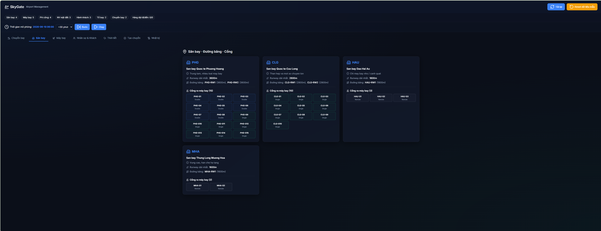
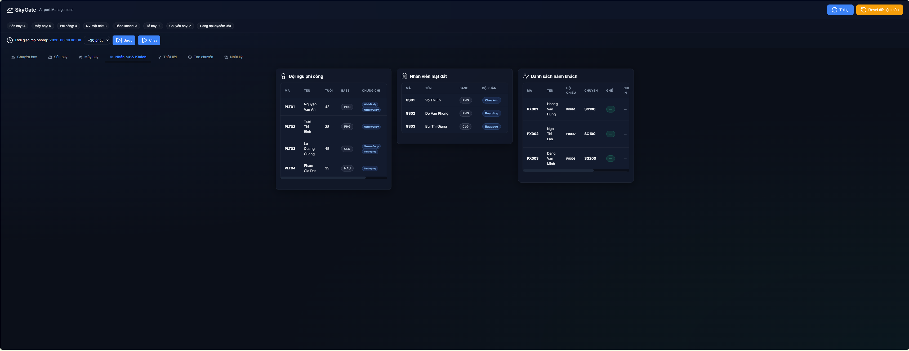
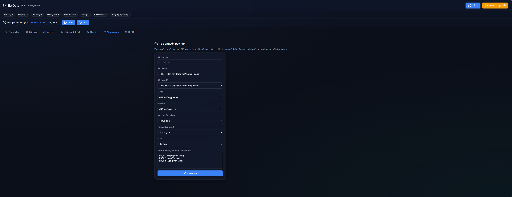

# SkyGate — Intelligent Airport Management System

Hệ thống mô phỏng quản lý sân bay thông minh (SkyGate) được xây dựng trên nền tảng C++ hướng đối tượng (OOP) ở Backend kết hợp với giao diện Web (HTML/CSS/JS) hiện đại ở Frontend thông qua giao thức truyền tải REST API. Đây là dự án Bài tập lớn hoàn thành môn học Lập trình hướng đối tượng (LTHDT) của Nhóm 5 — Trường Đại học Sư phạm Kỹ thuật TP.HCM (HCMUTE).

---

## 1. Tổng quan dự án

SkyGate được thiết kế nhằm mô phỏng toàn bộ hoạt động điều hành cốt lõi tại các cảng hàng không. Hệ thống giải quyết các bài toán tối ưu hóa nguồn lực thực tế như phân bổ đường băng, cổng đỗ (gate), quản lý phi hành đoàn (kiểm tra chứng chỉ bay, giới hạn giờ bay), điều phối cất/hạ cánh dưới tác động của thời tiết bất lợi và quản lý vòng đời hành khách từ đặt chỗ, check-in chọn ghế đến ký gửi hành lý.

---

## 2. Hình ảnh giao diện thực tế (Screenshots)

Dưới đây là một số hình ảnh demo trực quan về giao diện và chức năng của dự án:

### Bảng điều khiển chính (Dashboard)
Giao diện được thiết kế theo phong cách tối giản, sử dụng hiệu ứng kính mờ (Glassmorphism) và hỗ trợ hiển thị tốt trên cả máy tính lẫn điện thoại di động:


### Giám sát Sân bay & Cập nhật Thời tiết
Giám sát trạng thái hoạt động của đường băng, cổng đỗ (gate), phân bổ nhân viên trực ban và cập nhật tình tiết thời tiết trực quan:


### Quản lý Nhân sự & Hành khách
Bảng dữ liệu phi công, nhân viên mặt đất và danh sách hành khách được cấu trúc thành các cột dọc nhỏ gọn với thanh cuộn độc lập:


### Giao diện Tạo chuyến bay mới
Form cấu hình tạo chuyến bay kết hợp tự động gán máy bay, tổ bay trực ban, lựa chọn gate đỗ và đặt chỗ hành khách:


---

## 3. Kiến trúc và Thiết kế hướng đối tượng (OOP)

Dự án áp dụng chặt chẽ các nguyên lý thiết kế hướng đối tượng bền vững nhằm phân tách độc lập các luồng nghiệp vụ.

### Các nguyên lý OOP áp dụng

*   **Tính đóng gói (Encapsulation):** Toàn bộ dữ liệu nội tại của các thực thể (`Flight`, `Pilot`, `Aircraft`, `Gate`...) đều được khai báo bảo mật (`private` / `protected`) và chỉ được truy xuất qua các phương thức getter/setter hoặc giao diện công khai được kiểm soát chặt chẽ.
*   **Tính kế thừa (Inheritance):** 
    *   **Nhân sự:** Lớp cơ sở `Person` kế thừa bởi lớp `Staff`. Lớp `Staff` tiếp tục được kế thừa bởi các lớp chi tiết `Pilot` (Phi công) và `GroundStaff` (Nhân viên mặt đất).
    *   **Phương tiện:** Lớp cơ sở `Aircraft` (Máy bay) là lớp cha của các dòng máy bay chuyên biệt: `WideBodyAircraft`, `NarrowBodyAircraft` và `TurbopropAircraft`.
*   **Tính đa hình (Polymorphism):** Định nghĩa các phương thức ảo (`virtual`) trong lớp cơ sở như `Aircraft::minTurnaroundMinutes()` hay `Aircraft::requiredRunwayLength()` để mỗi lớp con tự quyết định cấu hình nghiệp vụ riêng.
*   **Mẫu thiết kế Factory (Factory Pattern):** Sử dụng `AircraftFactory` để khởi tạo linh hoạt các đối tượng máy bay dựa trên phân loại đầu vào mà không cần phơi bày logic khởi tạo phức tạp ra bên ngoài.

---

## 4. Các tính năng cốt lõi

### Quản lý tài nguyên hàng không
*   **Sân bay & Đường băng:** Giám sát các đường băng hiện có, đo lường chiều dài cất/hạ cánh tối thiểu cần thiết cho từng loại máy bay để phân bổ an toàn.
*   **Cổng đỗ (Gate):** Hỗ trợ nhiều loại gate (Single JetBridge, Double JetBridge, Remote Gate). Kiểm tra độ tương thích giữa loại gate và loại máy bay khi gán lịch đỗ.

### Phân bổ và giám sát chuyến bay
*   **Phi hành đoàn:** Tự động kiểm tra tính hợp lệ của tổ bay: phi công bắt buộc phải có chứng chỉ tương thích loại máy bay đó và tổng số giờ bay tích lũy trong tháng không được vượt quá 100 giờ.
*   **Lịch trình:** Tự động tính toán khung thời gian chiếm dụng cổng đỗ dựa trên thời gian quay đầu tối thiểu của từng dòng máy bay.

### Hệ thống mô phỏng thời gian thực
*   **Đồng hồ mô phỏng (Simulation Clock):** Đồng hồ ảo tuyến tính cho phép người vận hành tua nhanh thời gian (bằng phút/giờ). Khi thời gian dịch chuyển, trạng thái các chuyến bay sẽ tự động biến đổi theo vòng đời tuyến tính: `Scheduled` -> `Check-In` -> `Boarding` -> `Takeoff` -> `In Air` -> `Landed` -> `Completed`.
*   **Mô phỏng thời tiết xấu:** Khi áp dụng thời tiết bất lợi tại một sân bay, hệ thống tự động quét và hoãn (hoặc hủy) toàn bộ chuyến bay đi/đến sân bay đó trong khung giờ bị ảnh hưởng.

### Tương tác với hành khách
*   **Ký gửi hành lý:** Đo lường số kiện và khối lượng hành lý ký gửi, tự động cảnh báo cước phí nếu vượt quá giới hạn 23kg/kiện.
*   **Sơ đồ ghế ngồi động:** Giao diện hiển thị trực quan sơ đồ khoang hành khách theo từng cấu hình máy bay. Khóa tự động các ghế đã được check-in.

---

## 5. Cấu trúc mã nguồn

```text
├── docs/                           # Tài liệu thiết kế & ảnh chụp màn hình giao diện
│   └── images/                     # Các file ảnh sơ đồ thực tế
├── src/                            # Logic lõi Backend (C++ OOP)
│   ├── aircraft/                   # Phân lớp và Factory của Máy bay
│   ├── common/                     # Tiện ích chung, định dạng DateTime, Enums
│   ├── operations/                 # Logic Chuyến bay, Sân bay, Tổ bay, Cổng đỗ
│   ├── people/                     # Phân lớp Phi công, Nhân viên, Hành khách
│   ├── system/                     # Lớp quản lý trung tâm AirportSystem
│   └── web/                        # API Routing và Web Server (JSON Wrapper)
├── web/                            # Giao diện Frontend (HTML, CSS, Vanilla JS)
│   ├── index.html                  # Bố cục cấu trúc giao diện
│   ├── style.css                   # Thiết kế giao diện (Dark theme, Glassmorphism)
│   └── app.js                      # Xử lý sự kiện và kết nối API
├── data/                           # Dữ liệu lưu trữ cấu trúc dạng bảng (.txt)
├── .gitignore                      # Cấu hình loại bỏ file rác khi Git tracking
├── README.md                       # Tài liệu hướng dẫn sử dụng dự án này
├── skygate_web.exe                 # Chương trình chạy tích hợp Web Server dưới Windows
└── MoSkyGate.bat                   # File script khởi động nhanh trên Windows
```

---

## 5. Hướng dẫn cài đặt và vận hành

### Yêu cầu hệ thống
*   Hệ điều hành: Windows 10/11, macOS, hoặc Linux.
*   Bộ biên dịch C++ hỗ trợ chuẩn C++17 trở lên (GCC, Clang hoặc MSVC).
*   CMake (nếu muốn biên dịch lại từ mã nguồn).

### Cách chạy nhanh dưới Local (Windows)
Dự án đã được đóng gói sẵn file chạy tiện lợi:
1.  Tải mã nguồn về máy tính.
2.  Mở thư mục `skygate/`.
3.  Kích đúp vào file `MoSkyGate.bat` để chạy. Script sẽ tự động kích hoạt Server C++ tại cổng `8080` và mở giao diện Web trên trình duyệt mặc định của bạn.

*(Cách thủ công: Chạy `.\skygate_web.exe 8080` trong terminal tại thư mục `skygate/`, sau đó mở trình duyệt truy cập địa chỉ `http://localhost:8080`).*

### Cách tự biên dịch (Build) dự án từ mã nguồn
Nếu bạn thay đổi logic C++ ở Backend và muốn build lại:

**Dành cho Windows (sử dụng g++):**
Chạy script build được viết sẵn trong thư mục `skygate/`:
```bash
./build_web.sh
```

**Hoặc build thủ công bằng CMake:**
```bash
mkdir build
cd build
cmake ..
cmake --build . --config Release
```

---

## 6. Thành viên thực hiện (Nhóm 5)

*   **Nguyễn Ngọc Phi**
*   **Trần Thu Hằng**
*   **Lê Hồng Quang**
*   **Nguyễn Tấn Lộc**
*   **Phùng Chí Huy**
