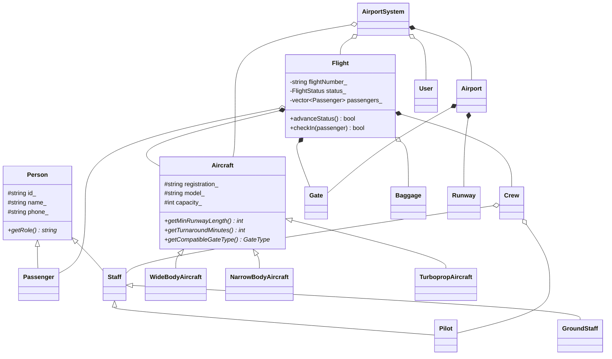
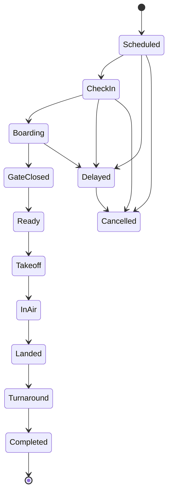
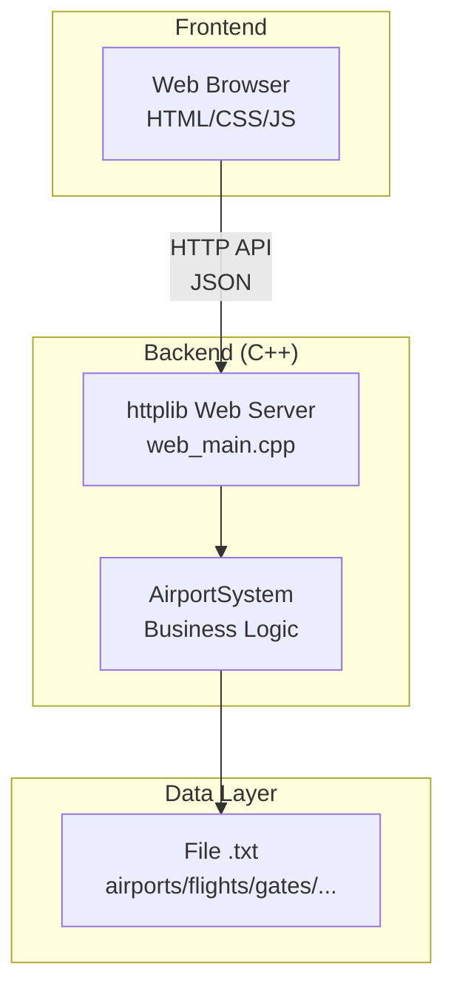

# DÀN Ý BÁO CÁO BÀI TẬP LỚN
## HỆ THỐNG QUẢN LÝ SÂN BAY SKYGATE
### Môn: Lập trình Hướng đối tượng — GVHD: ThS. Trần Thị Quỳnh Như — Nhóm 5

---

## PHẦN MỞ ĐẦU

### Trang bìa
- Tên trường, khoa, bộ môn
- Tên đề tài: **Hệ thống Quản lý Sân bay SkyGate (SkyGate Airport Management System)**
- Môn học: Lập trình Hướng đối tượng
- Danh sách thành viên nhóm 5 (Phi, Quang, Hằng, Lộc, Huy) kèm MSSV
- GVHD: ThS. Trần Thị Quỳnh Như
- Thời gian thực hiện

### Lời cảm ơn
- Cảm ơn giảng viên hướng dẫn
- Cảm ơn các thành viên nhóm

### Mục lục
- Tự động tạo mục lục từ các heading

### Danh mục hình ảnh / bảng biểu (nếu có)

---

## CHƯƠNG 1: TỔNG QUAN ĐỀ TÀI

### 1.1. Lý do chọn đề tài
- Sân bay là hệ thống phức tạp, nhiều đối tượng tương tác → phù hợp để áp dụng OOP
- Nhu cầu thực tế về quản lý: chuyến bay, hành khách, máy bay, tổ bay, hành lý...
- Bài toán có tính nghiệp vụ rõ ràng, dễ mô hình hóa bằng lớp và đối tượng

### 1.2. Mục tiêu đề tài
- Luyện tập phân tích bài toán theo hướng đối tượng
- Thiết kế hệ thống lớp có quan hệ kế thừa, đa hình, đóng gói, trừu tượng
- Xây dựng chương trình mô phỏng quản lý sân bay hoàn chỉnh (CLI + Web)
- Xử lý các tình huống nghiệp vụ: xung đột lịch, kiểm tra ràng buộc, quản lý trạng thái

### 1.3. Phạm vi và giới hạn
- **Trong phạm vi:** Quản lý 1 sân bay chính (SKG), quản lý chuyến bay, máy bay, hành khách, tổ bay, cổng, đường băng, hành lý, check-in, boarding
- **Ngoài phạm vi:** Không làm đặt vé, thanh toán, kinh doanh vé; hạn chế tính năng cụm tổ chức
- Tên SkyGate là tên giả lập, không sao chép thương hiệu thật

### 1.4. Công nghệ sử dụng
| Thành phần | Công nghệ |
|---|---|
| Ngôn ngữ chính | C++17 |
| Giao diện CLI | Console (main.cpp) |
| Web Server | httplib (C++ HTTP server) |
| Frontend Web | HTML + CSS + JavaScript (Vanilla) |
| Lưu trữ dữ liệu | File text (.txt) |
| Quản lý mã nguồn | Git / GitHub |

---

## CHƯƠNG 2: CƠ SỞ LÝ THUYẾT

### 2.1. Giới thiệu lập trình hướng đối tượng (OOP)
- Khái niệm OOP và lịch sử phát triển
- So sánh lập trình hướng đối tượng và lập trình hướng thủ tục

### 2.2. Bốn tính chất cơ bản của OOP

#### 2.2.1. Tính đóng gói (Encapsulation)
- Khái niệm: Che giấu dữ liệu nội bộ, chỉ truy cập qua phương thức
- **Áp dụng trong đề tài:**
  - Thuộc tính `private`/`protected`: mã chuyến bay, trạng thái, số giờ bay phi công...
  - Truy cập qua getter/setter
  - Ví dụ: lớp `Flight` che giấu `status_`, `passengers_`, chỉ thay đổi qua `advanceStatus()`

#### 2.2.2. Tính kế thừa (Inheritance)
- Khái niệm: Lớp con kế thừa thuộc tính/phương thức từ lớp cha
- **Áp dụng trong đề tài:**
  - `Person` → `Passenger`, `Staff`
  - `Staff` → `Pilot`, `GroundStaff`
  - `Aircraft` → `WideBodyAircraft`, `NarrowBodyAircraft`, `TurbopropAircraft`

#### 2.2.3. Tính đa hình (Polymorphism)
- Khái niệm: Cùng một phương thức, hành vi khác nhau tùy đối tượng
- **Áp dụng trong đề tài:**
  - Hàm ảo (`virtual`) trong lớp `Aircraft`: `getMinRunwayLength()`, `getTurnaroundMinutes()`, `getCompatibleGateType()`
  - Mỗi loại máy bay (WideBody, NarrowBody, Turboprop) trả về giá trị khác nhau
  - Hàm ảo trong `Person`: `getRole()` trả về vai trò khác nhau (Passenger, Pilot, GroundStaff...)

#### 2.2.4. Tính trừu tượng (Abstraction)
- Khái niệm: Mô hình hóa thực tế, ẩn chi tiết triển khai
- **Áp dụng trong đề tài:**
  - Lớp trừu tượng `Aircraft` định nghĩa giao diện chung cho mọi loại máy bay
  - Lớp `Person` là nền tảng chung cho mọi đối tượng con người trong hệ thống

### 2.3. Các khái niệm OOP nâng cao đã sử dụng
- **Composition (Thành phần):** Flight chứa Aircraft, Crew, Gate, danh sách Passenger
- **Factory Pattern:** `AircraftFactory` tạo đối tượng máy bay theo loại
- **Enum class:** Quản lý trạng thái chuyến bay (`FlightStatus`), loại cổng (`GateType`), loại đường băng...
- **Smart Pointers:** `shared_ptr`, `unique_ptr` quản lý bộ nhớ tự động

### 2.4. Giới thiệu ngôn ngữ C++ và các thư viện sử dụng
- C++17 features: `optional`, `string_view`, structured bindings
- STL containers: `vector`, `map`, `queue`
- Thư viện bên ngoài: `httplib` (web server), `nlohmann/json` hoặc JSON tự viết

---

## CHƯƠNG 3: PHÂN TÍCH VÀ THIẾT KẾ HỆ THỐNG

### 3.1. Phân tích yêu cầu

#### 3.1.1. Yêu cầu chức năng
| STT | Chức năng | Mô tả |
|---|---|---|
| 1 | Quản lý sân bay | CRUD sân bay, cổng, đường băng |
| 2 | Quản lý máy bay | Thêm/xem máy bay theo loại (WideBody, NarrowBody, Turboprop) |
| 3 | Quản lý chuyến bay | Tạo, cập nhật trạng thái, gán máy bay/tổ bay/cổng |
| 4 | Quản lý hành khách | Check-in, boarding, theo dõi trạng thái hành khách |
| 5 | Quản lý hành lý | Ghi nhận hành lý, cảnh báo quá cân/quá kiện |
| 6 | Quản lý tổ bay | Gán tổ bay, kiểm tra chứng chỉ, giờ bay, thời gian nghỉ |
| 7 | Điều phối sân bay | Hàng đợi cất/hạ cánh, ưu tiên khẩn cấp |
| 8 | Phân quyền | Admin vs Staff với chức năng khác nhau |
| 9 | Lưu/đọc dữ liệu | Xuất/nhập từ file text |
| 10 | Giao diện Web | Dashboard quản lý qua trình duyệt |

#### 3.1.2. Yêu cầu phi chức năng
- Giao diện trực quan, dễ sử dụng
- Dữ liệu nhất quán, tránh xung đột
- Xử lý lỗi rõ ràng với thông báo cho người dùng

### 3.2. Xác định các đối tượng (Classes)

#### Nhóm 1: Con người (`people/`)
| Lớp | Vai trò | Kế thừa từ |
|---|---|---|
| `Person` | Lớp cha — thông tin cá nhân | — |
| `Passenger` | Hành khách — check-in, boarding, hành lý | `Person` |
| `Staff` | Nhân viên (trừu tượng) | `Person` |
| `Pilot` | Phi công — chứng chỉ, giờ bay | `Staff` |
| `GroundStaff` | Nhân viên mặt đất | `Staff` |

#### Nhóm 2: Máy bay (`aircraft/`)
| Lớp | Vai trò | Kế thừa từ |
|---|---|---|
| `Aircraft` | Lớp cha — thông tin chung máy bay | — |
| `WideBodyAircraft` | Máy bay thân rộng (300-400 ghế) | `Aircraft` |
| `NarrowBodyAircraft` | Máy bay thân hẹp (150-220 ghế) | `Aircraft` |
| `TurbopropAircraft` | Máy bay cánh quạt (60-90 ghế) | `Aircraft` |
| `AircraftFactory` | Factory Pattern — tạo máy bay theo loại | — |

#### Nhóm 3: Vận hành (`operations/`)
| Lớp | Vai trò |
|---|---|
| `Airport` | Sân bay — quản lý cổng, đường băng |
| `Flight` | Chuyến bay — trạng thái, hành khách, tổ bay |
| `Gate` | Cổng ra máy bay — loại cổng, trạng thái |
| `Runway` | Đường băng — chiều dài, trạng thái |
| `Crew` | Tổ bay — phi công + nhân viên |
| `Baggage` | Hành lý — cân nặng, số kiện |
| `Ticket` | Vé — hạng ghế, giá |

#### Nhóm 4: Hệ thống (`system/`, `auth/`, `common/`, `web/`)
| Lớp | Vai trò |
|---|---|
| `AirportSystem` | Lớp điều khiển chính — CRUD, logic nghiệp vụ |
| `User` | Người dùng — xác thực, phân quyền (Admin/Staff) |
| `DateTime` | Xử lý ngày giờ |
| `Enums` | Định nghĩa các enum (FlightStatus, GateType...) |
| `Utils` | Tiện ích chung |
| `Json` | Xử lý JSON cho Web API |

### 3.3. Sơ đồ lớp (Class Diagram)

> [!TIP]
> Vẽ sơ đồ lớp UML thể hiện:
> - Quan hệ kế thừa: Person → Passenger/Staff → Pilot/GroundStaff; Aircraft → WideBody/NarrowBody/Turboprop
> - Quan hệ thành phần: Flight chứa Aircraft, Crew, Gate, list\<Passenger\>, list\<Baggage\>
> - Quan hệ liên kết: Airport chứa list\<Gate\>, list\<Runway\>, list\<Flight\>



### 3.4. Sơ đồ trạng thái chuyến bay (State Diagram)



### 3.5. Kiến trúc hệ thống (Architecture)



### 3.6. Thiết kế cơ sở dữ liệu (File-based)
- Mô tả cấu trúc từng file dữ liệu: `airports.txt`, `flights.txt`, `gates.txt`, `runways.txt`, `aircrafts.txt`, `passengers.txt`, `crews.txt`, `users.txt`
- Định dạng mỗi dòng, ký tự phân cách
- Quy ước mã nội bộ (SKG, CLG, HAU, MHA)

### 3.7. Thiết kế giao diện Web
- Layout tổng thể: Sidebar navigation + Main content area
- Các tab chính: Dashboard, Flights, Aircraft, Passengers, Gates, Runways
- Phân quyền: Admin thấy tất cả, Staff bị giới hạn

---

## CHƯƠNG 4: CÀI ĐẶT VÀ TRIỂN KHAI

### 4.1. Cấu trúc thư mục mã nguồn
```
skygate/
├── src/
│   ├── aircraft/       # Các lớp máy bay + Factory
│   ├── auth/           # Xác thực, phân quyền (User)
│   ├── common/         # Tiện ích chung (DateTime, Enums, Utils)
│   ├── operations/     # Lớp vận hành (Flight, Gate, Runway, Baggage...)
│   ├── people/         # Lớp con người (Person, Passenger, Pilot...)
│   ├── system/         # AirportSystem — logic trung tâm
│   ├── web/            # Web server (httplib, JSON handler)
│   └── main.cpp        # Điểm khởi chạy chương trình
├── web/                # Frontend (HTML, CSS, JS)
├── data/               # File dữ liệu (.txt)
└── CMakeLists.txt      # Cấu hình biên dịch
```

### 4.2. Cài đặt các lớp chính (kèm đoạn code tiêu biểu)

> [!IMPORTANT]
> **Không paste toàn bộ code.** Chỉ trích dẫn những đoạn code thể hiện rõ nhất các nguyên lý OOP.

#### 4.2.1. Kế thừa — Hệ thống phân cấp Aircraft
- Code minh họa: Lớp cha `Aircraft` với hàm ảo thuần túy, lớp con override

#### 4.2.2. Đa hình — Kiểm tra điều kiện máy bay
- Code minh họa: Gọi `aircraft->getMinRunwayLength()` trên con trỏ `Aircraft*`, kết quả khác nhau tùy loại

#### 4.2.3. Đóng gói — Quản lý trạng thái chuyến bay
- Code minh họa: `Flight::advanceStatus()` kiểm tra logic trước khi chuyển trạng thái

#### 4.2.4. Factory Pattern — AircraftFactory
- Code minh họa: Tạo đối tượng máy bay mà không cần biết lớp con cụ thể

#### 4.2.5. Composition — Flight chứa nhiều đối tượng
- Code minh họa: Flight sở hữu Aircraft, Crew, Gate, danh sách Passenger

### 4.3. Cài đặt các quy tắc nghiệp vụ
| Quy tắc | Đối tượng kiểm tra | Xử lý khi vi phạm |
|---|---|---|
| Chứng chỉ máy bay | Pilot | Từ chối gán tổ bay |
| Giới hạn 100 giờ bay/tháng | Pilot | Không cho gán |
| Thời gian nghỉ tối thiểu 8h | Crew | Không cho gán |
| Đường băng đủ dài | Runway vs Aircraft | Từ chối lập lịch |
| Gate phù hợp loại máy bay | Gate vs Aircraft | Từ chối gán gate |
| Xung đột lịch trình gate | Gate | Từ chối gán |
| Xung đột lịch máy bay | Aircraft | Từ chối tạo chuyến |
| Hành lý quá cân (>23kg/kiện) | Baggage | Cảnh báo |
| Hành lý quá kiện (>2 kiện) | Baggage | Cảnh báo |

### 4.4. Cài đặt Web Server và REST API
- Mô tả kiến trúc: C++ httplib server expose REST API
- Các endpoint chính: `/api/flights`, `/api/aircrafts`, `/api/passengers`, `/api/login`...
- Format request/response: JSON
- Phân quyền: Kiểm tra token/session khi gọi API

### 4.5. Cài đặt giao diện Web (Frontend)
- Công nghệ: HTML5 + CSS3 + Vanilla JavaScript
- Thiết kế responsive, light theme hiện đại
- Các trang chính: Login, Dashboard, Flight Management, Passenger Management...
- Tương tác: Fetch API gọi đến C++ backend

---

## CHƯƠNG 5: KẾT QUẢ VÀ KIỂM THỬ

### 5.1. Hướng dẫn biên dịch và chạy chương trình
- Yêu cầu hệ thống (CMake, compiler C++17)
- Các bước biên dịch
- Cách chạy chương trình (CLI và Web mode)

### 5.2. Kết quả chạy thử — Ảnh chụp màn hình

> [!TIP]
> Chụp screenshot rõ ràng cho từng chức năng, kèm chú thích bên dưới mỗi ảnh.

#### 5.2.1. Giao diện đăng nhập
#### 5.2.2. Dashboard tổng quan
#### 5.2.3. Quản lý chuyến bay (tạo, xem, cập nhật trạng thái)
#### 5.2.4. Gán máy bay và tổ bay cho chuyến bay
#### 5.2.5. Check-in hành khách
#### 5.2.6. Boarding và đóng cổng
#### 5.2.7. Quản lý hành lý (cảnh báo quá cân/quá kiện)
#### 5.2.8. Hoãn/Hủy chuyến bay
#### 5.2.9. Phân quyền Admin vs Staff

### 5.3. Kiểm thử các tình huống đặc biệt
| STT | Tình huống | Kết quả mong đợi | Kết quả thực tế |
|---|---|---|---|
| 1 | Tạo chuyến bay trùng lịch máy bay | Từ chối, thông báo lỗi | ✅/❌ |
| 2 | Gán pilot thiếu chứng chỉ | Từ chối | ✅/❌ |
| 3 | Hành lý > 23kg | Cảnh báo quá cân | ✅/❌ |
| 4 | Hành lý > 2 kiện | Cảnh báo quá kiện | ✅/❌ |
| 5 | Boarding khi gate đã đóng | Từ chối | ✅/❌ |
| 6 | Hoãn chuyến bay đang bay | Không cho phép | ✅/❌ |
| 7 | Đường băng quá ngắn cho máy bay | Từ chối | ✅/❌ |

---

## CHƯƠNG 6: KẾT LUẬN VÀ HƯỚNG PHÁT TRIỂN

### 6.1. Kết quả đạt được
- Xây dựng thành công hệ thống quản lý sân bay với đầy đủ các chức năng cơ bản
- Áp dụng 4 tính chất OOP: đóng gói, kế thừa, đa hình, trừu tượng
- Sử dụng Design Pattern: Factory Pattern, Composition
- Xây dựng giao diện Web hiện đại, trực quan
- Xử lý các ràng buộc nghiệp vụ phức tạp

### 6.2. Phân công công việc
| Thành viên | MSSV | Công việc phụ trách |
|---|---|---|
| Nguyễn Ngọc Trường Phi | 23119187 | *(điền)* |
| Vũ Minh Quang | 23119198 | *(điền)* |
| Nguyễn Thị Thúy Hằng | 23119142 | *(điền)* |
| Nguyễn Đức Lộc | 23119165 | *(điền)* |
| Phạm Gia Huy | 23119148 | *(điền)* |

### 6.3. Hạn chế
- Dữ liệu lưu bằng file text, chưa dùng database thật
- Chưa có unit test tự động
- Chưa triển khai mô phỏng thời tiết xấu
- Giao diện CLI và Web chưa đồng bộ 100% chức năng

### 6.4. Hướng phát triển
- Chuyển sang cơ sở dữ liệu (SQLite/MySQL)
- Thêm chức năng mô phỏng thời tiết xấu, tự động hoãn/hủy chuyến
- Bổ sung unit test
- Triển khai trên server thật (Docker)
- Thêm chức năng thống kê, biểu đồ trên dashboard
- Hỗ trợ đa ngôn ngữ (Tiếng Việt / English)

---

## PHẦN PHỤ LỤC

### Tài liệu tham khảo
- Sách giáo trình C++ OOP
- Tài liệu httplib
- Các trang web tham khảo (cppreference.com, stackoverflow.com...)

### Phụ lục A: Mã nguồn các lớp chính
- *(Đính kèm code đầy đủ nếu giảng viên yêu cầu)*

### Phụ lục B: Link GitHub repository

---

## 📝 GHI CHÚ KHI VIẾT BÁO CÁO

> [!IMPORTANT]
> **Những điểm cần nhấn mạnh để đạt điểm cao:**

1. **Tập trung vào OOP:** Giảng viên chấm dựa trên **tư duy thiết kế lớp**, không chỉ xem chương trình chạy hay không. Hãy giải thích **tại sao** bạn dùng kế thừa, **tại sao** dùng đa hình.

2. **Class Diagram là trọng tâm:** Vẽ sơ đồ lớp UML rõ ràng, đầy đủ quan hệ. Đây là phần quan trọng nhất của chương 3.

3. **Code minh họa, không paste hết:** Chỉ trích dẫn đoạn code tiêu biểu nhất (kế thừa, đa hình, factory...), giải thích từng dòng.

4. **Screenshot kèm chú thích:** Mỗi ảnh chụp phải có mô tả rõ ràng bên dưới.

5. **Bảng phân công rõ ràng:** Ghi rõ ai làm gì, chiếm bao nhiêu %.

6. **Highlight điểm đặc biệt** của project:
   - Web interface (không phải chỉ CLI)
   - Factory Pattern
   - State machine cho trạng thái chuyến bay (10 trạng thái)
   - Hệ thống phân quyền Admin/Staff
   - Kiểm tra ràng buộc nghiệp vụ phức tạp (chứng chỉ, giờ bay, xung đột lịch...)
