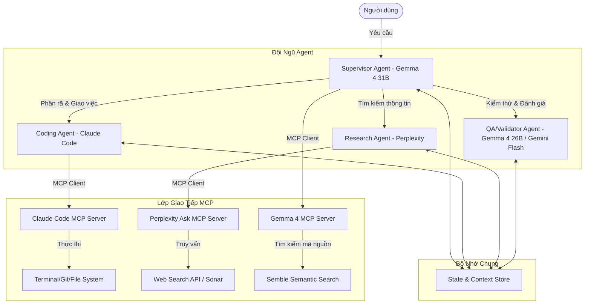
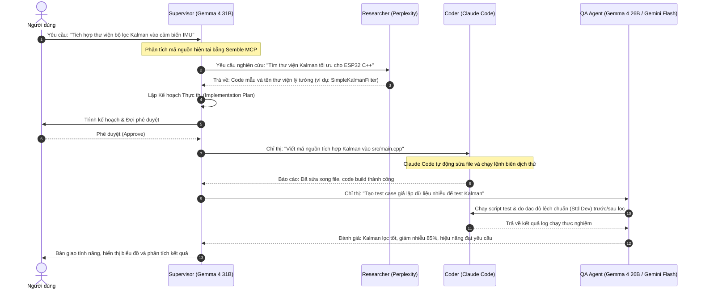

# TÀI LIỆU THIẾT KẾ: HỆ THỐNG ĐIỀU PHỐI ĐỘI NGŨ AGENT (AGENT HARNESS)
## Tích hợp đa mô hình qua Model Context Protocol (MCP)

Tài liệu này trình bày thiết kế kiến trúc hệ thống điều phối đa Agent (Multi-Agent Harness) tận dụng tối đa sức mạng của các mô hình AI sẵn có thông qua giao thức **Model Context Protocol (MCP)**. Hệ thống được thiết kế để tự động hóa các tác vụ phức tạp liên quan đến lập trình nhúng, nghiên cứu khoa học và phát triển phần mềm.

---

## 1. Kiến Trúc Tổng Quan (System Architecture)

Hệ thống hoạt động theo mô hình **Supervisor-Workers** (Điều phối viên - Thực thi viên), kết hợp với cơ chế **Event-Driven Bus** để chia sẻ trạng thái và bộ nhớ ngữ cảnh giữa các Agent.

---

## 2. Vai Trò & Phân Nhiệm Của Đội Ngũ Agent

Hệ thống phân chia nhiệm vụ dựa trên thế mạnh đặc trưng của từng mô hình AI thông qua cấu hình MCP:

| Agent | Mô hình AI (MCP) | Nhiệm vụ chính | Điểm mạnh khai thác |
| :--- | :--- | :--- | :--- |
| **Supervisor Agent** (Điều phối viên) | `gemma-4-31b-it` | Phân tích yêu cầu người dùng, lên kế hoạch (Implementation Plan), điều phối công việc cho các Agent khác và tổng hợp kết quả cuối cùng. | Khả năng suy luận logic chuỗi dài (Reasoning), quản lý ngữ cảnh lớn (Long Context Window). |
| **Coding Agent** (Lập trình viên) | `Claude Code` | Chỉnh sửa code, tạo file mới, quản lý Git branch, chạy lệnh build/compile và cấu hình môi trường. | Khả năng tương tác trực tiếp với CLI/File System của Claude CLI thông qua MCP. Chỉnh sửa code có độ chính xác cao. |
| **Research Agent** (Nhà nghiên cứu) | `Perplexity (Sonar)` | Tìm kiếm tài liệu, tra cứu thư viện API mới nhất, đối chiếu các bài báo khoa học và giải quyết các lỗi cấu hình lạ. | Khả năng tìm kiếm thời gian thực (Real-time Web Search) và tổng hợp thông tin không bị giới hạn bởi thời điểm khóa tri thức (knowledge cutoff). |
| **QA/Validator Agent** (Kiểm thử viên) | `gemma-4-26b-a4b-it` / `gemini-2.5-flash` | Viết unit test, chạy kiểm thử tự động, kiểm tra các lỗi bảo mật tĩnh (Static Analysis) và rà soát linting. | Tốc độ xử lý cực nhanh, chi phí thấp, tối ưu cho các tác vụ kiểm tra lặp đi lặp lại. |

---

## 3. Luồng Xử Lý Tác Vụ Chi Tiết (Data & Workflow Pipeline)

Quy trình tự động hóa giải quyết một yêu cầu phát triển tính năng mới:

---

## 4. Cơ Chế Chia Sẻ Trạng Thái & Đồng Bộ Bộ Nhớ (State & Context Management)

Để các Agent không bị chồng chéo công việc và luôn đồng bộ thông tin, hệ thống sử dụng cơ chế **Workspace Context State**:
1. **Shared Workspace (Không gian làm việc chung):** Toàn bộ Agent hoạt động chung trên một thư mục dự án (ví dụ: `d:\LTHDT`).
2. **Context Memory File (`context.json`):** Lưu trữ trạng thái hiện tại của hệ thống dưới dạng cấu trúc dữ liệu JSON để các Agent cùng đọc/ghi:
   * Danh sách file đang được chỉnh sửa.
   * Lịch sử các bước đã thực hiện.
   * Kết quả phân tích từ Research Agent để Coding Agent lấy làm tài liệu tham khảo trực tiếp.
3. **Execution Plan (`task.md`):** Đóng vai trò là bảng Kanban chung. Supervisor cập nhật tiến độ (`[ ]`, `[/]`, `[x]`), các Agent thực thi sẽ kiểm tra file này để biết bước tiếp theo cần làm gì.

---

## 5. Cơ Chế Bảo Mật & An Toàn Hệ Thống (Sandbox & Permission Control)

Vì hệ thống tích hợp các Agent tự động có khả năng chạy lệnh Terminal và thay đổi hệ thống (như Claude Code):
* **Sandboxing:** Mọi lệnh thực thi có tính rủi ro cao (như build, cài thư viện ngoài, chạy code python kiểm thử) sẽ được chạy trong môi trường sandbox hoặc phải qua bước phê duyệt từ User (`Y/N`).
* **Lớp kiểm soát quyền (Permission Layer):** 
  * Cấp quyền đọc (`read_file`) rộng rãi cho các Agent để phân tích ngữ cảnh.
  * Giới hạn quyền ghi (`write_file`) và chạy lệnh (`run_command`) theo từng thư mục cụ thể của dự án để tránh ảnh hưởng đến các thư mục hệ thống của máy chủ vật lý.
  * Sử dụng công cụ `gitnexus_impact` trước khi bất kỳ thay đổi nào được ghi vào file để dự báo mức độ ảnh hưởng của thay đổi lên toàn bộ call graph của hệ thống.

---

> [!TIP]
> **Hướng phát triển tiếp theo:** Tích hợp trực tiếp các MCP server này vào một SDK chung (như Genkit hoặc LangGraph) để quản lý luồng trạng thái (State Graph) một cách trực quan, giúp giám sát thời gian thực tiến độ của từng Agent trong đội ngũ.
