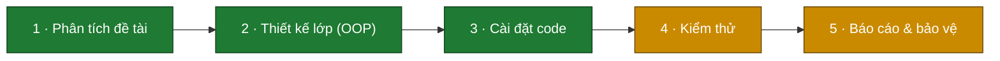
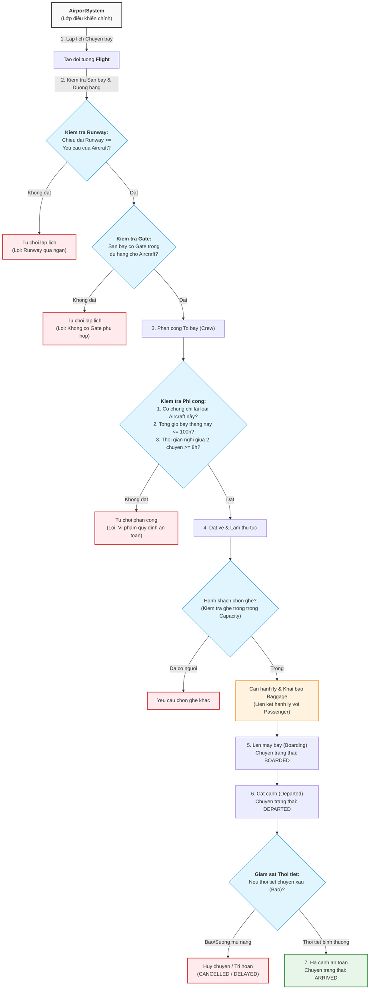
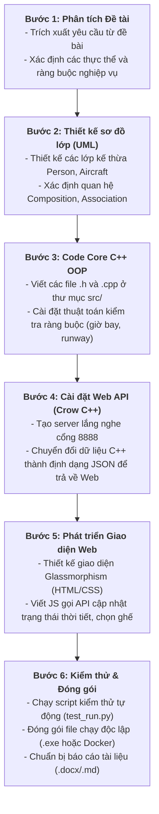
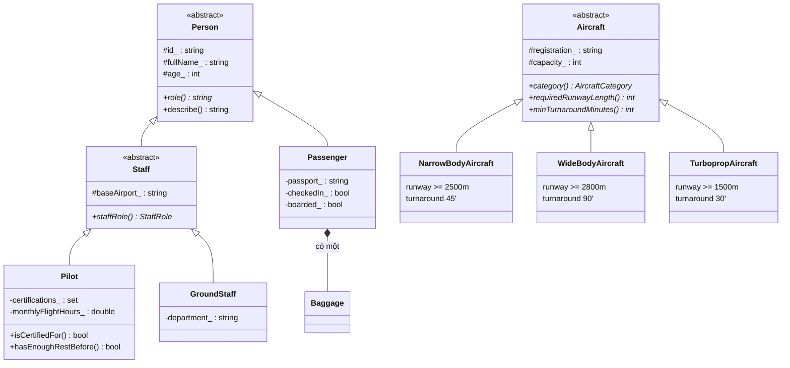
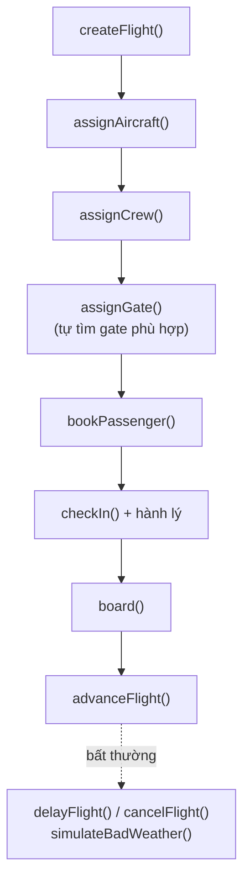

# SkyGate — Bảng tiến độ dự án (OOP)

> Hệ thống mô phỏng quản lý sân bay · C++ thuần OOP · Nhóm 5
> Cập nhật: 2026-06-09 · Nguồn: code thực tế trên đĩa (xác minh qua CodeGraph)

---

## 1. Tiến độ qua các giai đoạn

Chú thích: 🟩 xong · 🟧 đang làm · ⬛ chưa bắt đầu

---

## 2. Sơ đồ Khung Dự án & Quy trình Phát triển (Top-Down Flow)

Dưới đây là sơ đồ chi tiết về cấu trúc hệ thống từ trên xuống và quy trình thực hiện dự án:

### A. Sơ đồ Kiến trúc Hệ thống (Top-Down System Architecture)
Sơ đồ này mô tả cách các thành phần trong dự án SkyGate tương tác với nhau, từ giao diện người dùng đến mã nguồn lõi C++ và lưu trữ:

### B. Quy trình thực hiện qua các giai đoạn (Development Workflow)
Sơ đồ mô tả quy trình xây dựng dự án từ lúc nhận đề bài cho đến khi hoàn thành đóng gói:

---

## 3. Trạng thái chi tiết

| # | Giai đoạn | Trạng thái | Bằng chứng |
|---|-----------|-----------|------------|
| 1 | Phân tích đề tài | ✅ Xong | `requirements.txt` đã trích đủ yêu cầu (sân bay, chuyến bay, máy bay, người, gate, runway, hành lý) |
| 2 | Thiết kế lớp | ✅ Xong | Cây kế thừa `Person`/`Staff`, `Aircraft` đã định hình; comment thiết kế trong mỗi header |
| 3 | Cài đặt code | ✅ Xong | Đủ `.h`/`.cpp` trong `skygate/src/`; build ra `skygate.exe` |
| 4 | Kiểm thử | 🟧 Đang làm | Có `test_run.py` + exe; **chưa xác minh test pass** |
| 5 | Báo cáo & bảo vệ | 🟧 Đang làm | Có `.docx` đề xuất/đề tài; chưa chốt bản cuối |

---

## 4. Sơ đồ lớp (sản phẩm của giai đoạn 2 — Thiết kế)

---

## 5. Lớp điều khiển & luồng nghiệp vụ chính

`AirportSystem` là lớp điều khiển trung tâm, nắm các danh sách đối tượng và
điều phối nghiệp vụ. Luồng vòng đời một chuyến bay:

Quy tắc nghiệp vụ được kiểm tra (theo requirements):
- Phi công: ≤ 100 giờ bay/tháng, nghỉ ≥ 8 tiếng giữa 2 chuyến, đúng chứng chỉ loại máy bay.
- Đường băng: chiều dài thực tế ≥ yêu cầu của máy bay, nếu không → từ chối lập lịch.
- Gate: phải đủ hạng (`minGateRank`) cho loại máy bay.

---

## 6. Việc còn lại

- [ ] Chạy `test_run.py`, ghi lại kết quả pass/fail vào mục Kiểm thử.
- [ ] Bổ sung test cho các quy tắc biên (giờ bay = 100, runway = đúng ngưỡng).
- [ ] Hoàn thiện báo cáo `.docx`: chèn 3 sơ đồ ở trên.
- [ ] Chuẩn bị kịch bản demo khi bảo vệ (seed dữ liệu mẫu qua `seedDemoData()`).
